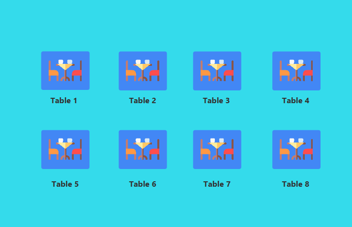
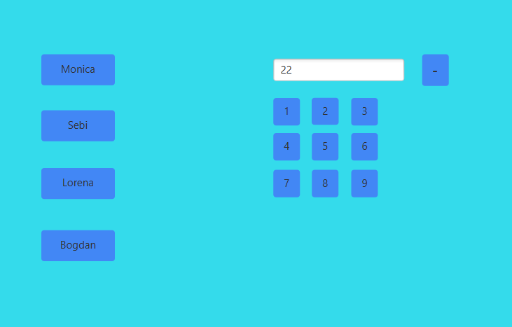
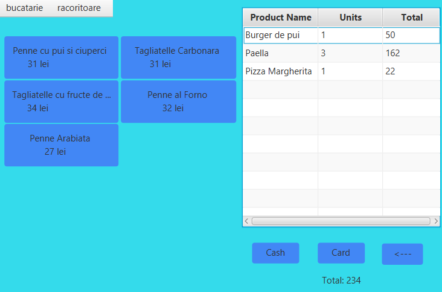

# Restaurant Order Management System

## Overview

This project is a **Graphical User Interface (GUI)** application designed for waiters to manage client orders in a restaurant. The application is developed using **JavaFX** for the front-end **Java and OOP concepts** for backend and **PostgreSQL** for the database. The system is optimized for use on tactile screens, eliminating the need for a physical keyboard. It provides an intuitive and efficient way for waiters to handle orders, manage tables, and process payments.

---

## Key Features

### 1. Table Selection
- The interface displays a visual representation of all tables in the restaurant.
- Waiters can select a free table to place an order.
- The table selection screen uses a combination of **simple buttons** and **image views** for an interactive and user-friendly experience.

### 2. Waiter Authentication
- Waiters are required to log in using a **2-digit PIN**.
  - If the PIN is correct, the waiter is redirected to the **menu page**.
  - If the PIN is incorrect, the waiter is redirected back to the **table selection screen**.
- The left side of the authentication screen displays buttons for all waiters, allowing the waiter to select their corresponding profile after entering the PIN.

### 3. Menu Navigation
- The menu page features a **menu bar** with categories found in every restaurant (e.g., kitchen, drinks).
- Each category contains **subcategories**, which are displayed below the main menu bar (e.g., pizza, pasta, juices).
- For each subcategory, a list of products is shown as **interactive buttons**, allowing waiters to add items to the order.

### 4. Order Management
- The right side of the interface displays a **list of products** added to the current table's order.
- Each product in the list shows:
  - The name of the item.
  - The quatity of a certain item.
  - The price of the item multiplied by the quantity.
- If an item is added multiple times, the **quantity is incremented** in the database instead of creating duplicate entries.
- A **label** at the bottom of the screen displays the **total cost** of the order for the selected table.

### 5. Order Modification
- **Double-clicking** an item in the order list initiates the cancellation process:
  - If the item's quantity is greater than 1, the quantity is **decremented**.
  - If the quantity is 1, the item is **removed** from the list entirely.

### 6. Payment Processing
- The interface includes two payment options:
  - **Cash**: Processes the payment and clears the order for the table.
  - **Card**: Processes the payment and clears the order for the table.
- After payment, a **confirmation message** is displayed based on the chosen payment method.

### 7. Navigation
- An **arrow back button** allows waiters to return to the **table selection screen** without losing the current order data.

---

## Workflow

1. **Table Selection**:
   - The waiter selects a free table from the table selection screen.

2. **Waiter Authentication**:
   - The waiter enters their 2-digit PIN and selects their profile from the list of waiters.

3. **Menu Navigation**:
   - The waiter navigates through the menu categories and subcategories to select items for the order.

4. **Order Management**:
   - The waiter adds items to the order, which are displayed in the order list with their respective quantities and prices.
   - The total cost of the order is dynamically updated and displayed.

5. **Order Modification**:
   - The waiter can modify the order by double-clicking items to decrement or remove them.

6. **Payment Processing**:
   - The waiter processes the payment using the **Cash** or **Card** button, which clears the order and displays a confirmation message.

7. **Navigation**:
   - The waiter can return to the table selection screen using the **arrow back button** without losing the current order data.
